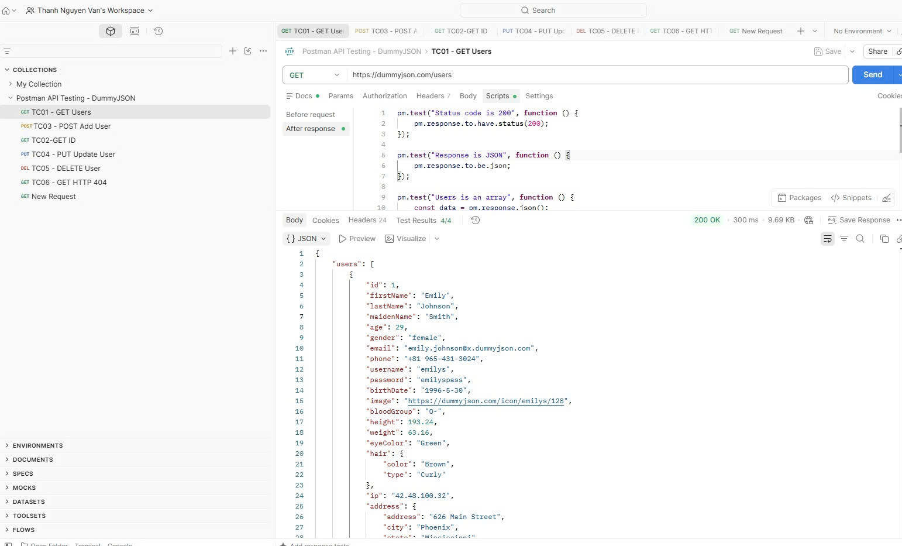
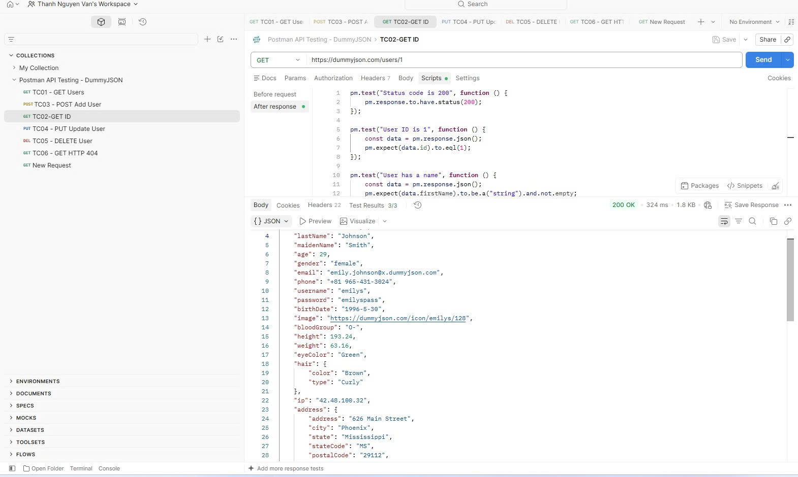
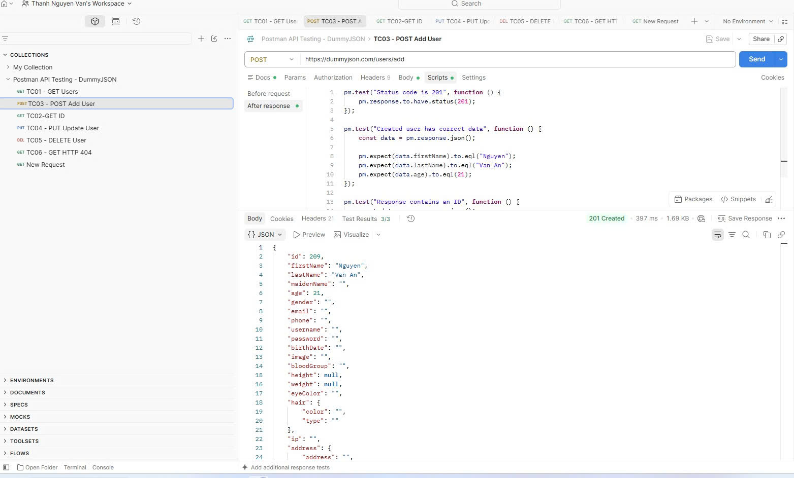
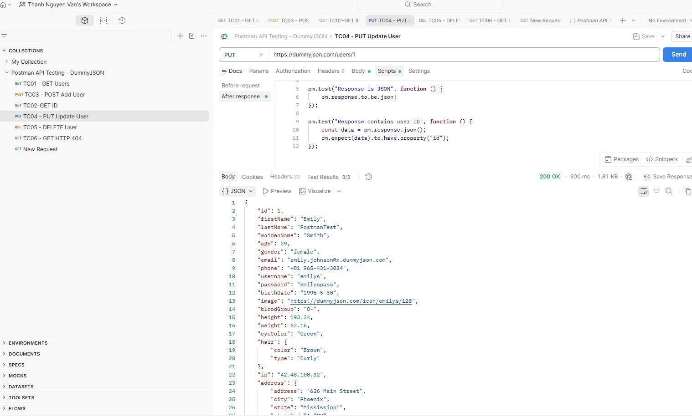
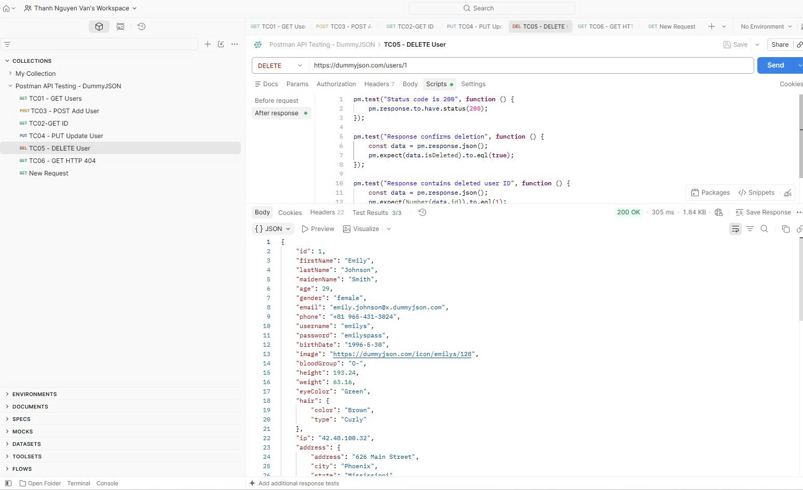
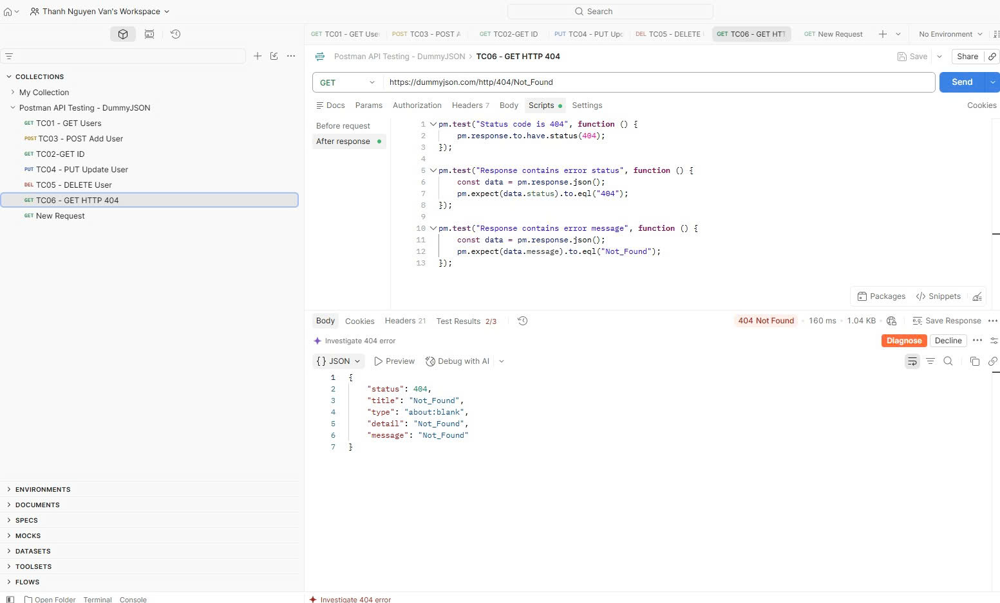

# BÁO CÁO KIỂM THỬ API BẰNG POSTMAN

## 1. Thông tin dự án

- **Tên dự án:** Postman API Testing - DummyJSON
- **Công cụ kiểm thử:** Postman
- **API sử dụng:** DummyJSON
- **Ngày kiểm thử:** 07/10/2026
- **Người kiểm thử:** Nguyễn Văn Thành
- **Mã sinh viên:** 23010191

---

## 2. Mục tiêu kiểm thử

Sử dụng phần mềm Postman để thực hiện kiểm thử các API của DummyJSON.

Các nội dung kiểm thử bao gồm:

- Kiểm thử phương thức HTTP GET.
- Kiểm thử phương thức HTTP POST.
- Kiểm thử phương thức HTTP PUT.
- Kiểm thử phương thức HTTP DELETE.
- Kiểm tra HTTP Status Code.
- Kiểm tra dữ liệu trả về trong Response.
- Sử dụng Postman Tests để thực hiện kiểm thử tự động.
- Kiểm thử trường hợp API trả về lỗi HTTP 404.

---

## 3. Môi trường kiểm thử

| Thành phần | Thông tin |
|---|---|
| Hệ điều hành | Windows |
| Công cụ | Postman |
| API | DummyJSON |
| Giao thức | HTTP/HTTPS |
| Phương thức kiểm thử | Manual Testing và Automated Testing |

---

## 4. Phương pháp kiểm thử

Trong bài thực hành sử dụng các phương pháp:

1. **Manual API Testing:** gửi request trực tiếp bằng Postman và quan sát response.
2. **Status Code Testing:** kiểm tra HTTP Status Code.
3. **Response Body Testing:** kiểm tra dữ liệu JSON trả về.
4. **Positive Testing:** kiểm tra các request hợp lệ.
5. **Negative Testing:** kiểm tra trường hợp API trả về lỗi.
6. **Automated Testing:** sử dụng JavaScript trong phần Tests/Post-response của Postman.

---

# 5. Danh sách các kịch bản kiểm thử

| ID | Tên kịch bản | Method | API | Kết quả mong đợi | Trạng thái |
|---|---|---|---|---|---|
| TC01 | Lấy danh sách Users | GET | `/users` | 200 OK | [PASS/FAIL] |
| TC02 | Lấy thông tin User theo ID | GET | `/users/1` | 200 OK | [PASS/FAIL] |
| TC03 | Thêm User | POST | `/users/add` | 201 Created | [PASS/FAIL] |
| TC04 | Cập nhật User | PUT | `/users/1` | 200 OK | [PASS/FAIL] |
| TC05 | Xóa User | DELETE | `/users/1` | 200 OK | [PASS/FAIL] |
| TC06 | Kiểm thử HTTP 404 | GET | `/http/404/Not_Found` | 404 Not Found | [PASS/FAIL] |

> **Lưu ý:** Điền cột "Trạng thái" theo kết quả thực tế bạn chạy trên Postman.

---

# 6. Chi tiết các kịch bản kiểm thử

## 6.1. TC01 - GET danh sách Users

### Thông tin kiểm thử

- **Tên kịch bản:** Kiểm thử lấy danh sách Users
- **Mục đích:** Kiểm tra API có thể trả về danh sách người dùng hay không.
- **Phương thức HTTP:** GET
- **URL:** `https://dummyjson.com/users`
- **Tham số:** Không có
- **Kết quả mong đợi:** API trả về HTTP Status Code `200 OK` và dữ liệu JSON chứa danh sách Users.
- **Kết quả thực tế:** [Điền kết quả thực tế]
- **Trạng thái:** [PASS/FAIL]

### Các bước thực hiện

1. Mở Postman.
2. Chọn Collection `Postman API Testing - DummyJSON`.
3. Tạo request `TC01 - GET Users`.
4. Chọn phương thức `GET`.
5. Nhập URL:
   `https://dummyjson.com/users`
6. Nhấn **Send**.
7. Kiểm tra Status Code.
8. Kiểm tra Response Body.
9. Kiểm tra kết quả các bài Test.

### Kiểm thử tự động

```javascript
pm.test("Status code is 200", function () {
    pm.response.to.have.status(200);
});

pm.test("Response is JSON", function () {
    pm.response.to.be.json;
});

pm.test("Users is an array", function () {
    const data = pm.response.json();
    pm.expect(data.users).to.be.an("array");
    pm.expect(data.users.length).to.be.greaterThan(0);
});

pm.test("Response has pagination fields", function () {
    const data = pm.response.json();
    pm.expect(data).to.have.property("total");
    pm.expect(data).to.have.property("skip");
    pm.expect(data).to.have.property("limit");
});
```

### Kết quả sau khi kiểm thử

> **Chèn ảnh Postman của TC01 tại đây.**



## 6.2. TC02 - GET User theo ID

### Thông tin kiểm thử

- **Tên kịch bản:** Kiểm thử lấy thông tin User theo ID
- **Mục đích:** Kiểm tra API có trả về đúng thông tin User có ID = 1 hay không.
- **Phương thức HTTP:** GET
- **URL:** `https://dummyjson.com/users/1`
- **Tham số:** ID = 1
- **Kết quả mong đợi:** API trả về HTTP Status Code `200 OK` và User có ID bằng 1.
- **Kết quả thực tế:** [Điền kết quả thực tế]
- **Trạng thái:** [PASS/FAIL]

### Kiểm thử tự động

```javascript
pm.test("Status code is 200", function () {
    pm.response.to.have.status(200);
});

pm.test("User ID is 1", function () {
    const data = pm.response.json();
    pm.expect(data.id).to.eql(1);
});

pm.test("User has a name", function () {
    const data = pm.response.json();
    pm.expect(data.firstName).to.be.a("string").and.not.empty;
});
```

### Kết quả sau khi kiểm thử

> **Chèn ảnh Postman của TC02 tại đây.**



## 6.3. TC03 - POST thêm User

### Thông tin kiểm thử

- **Tên kịch bản:** Kiểm thử thêm User
- **Mục đích:** Kiểm tra API có nhận dữ liệu User mới hay không.
- **Phương thức HTTP:** POST
- **URL:** `https://dummyjson.com/users/add`
- **Body:** JSON
- **Kết quả mong đợi:** API trả về HTTP Status Code `201 Created` và Response chứa dữ liệu User đã gửi.
- **Kết quả thực tế:** [Điền kết quả thực tế]
- **Trạng thái:** [PASS/FAIL]

### Request Body

> ** Body **

```json
{
    "firstName": "Nguyen",
    "lastName": "Van An",
    "age": 21
}
```

### Các bước thực hiện

1. Tạo request `TC03 - POST Add User`.
2. Chọn phương thức `POST`.
3. Nhập URL:
   `https://dummyjson.com/users/add`
4. Chọn **Body → raw → JSON**.
5. Nhập Request Body.
6. Nhấn **Send**.
7. Kiểm tra Status Code.
8. Kiểm tra Response.
9. Kiểm tra kết quả Test.

### Kiểm thử tự động

```javascript
pm.test("Status code is 201", function () {
    pm.response.to.have.status(201);
});

pm.test("Created user has correct data", function () {
    const data = pm.response.json();

    pm.expect(data.firstName).to.eql("Nguyen");
    pm.expect(data.lastName).to.eql("Van An");
    pm.expect(data.age).to.eql(21);
});

pm.test("Response contains an ID", function () {
    const data = pm.response.json();
    pm.expect(data).to.have.property("id");
});
```

### Kết quả sau khi kiểm thử

> **Chèn ảnh Postman của TC03 tại đây.**




## 6.4. TC04 - PUT cập nhật User

### Thông tin kiểm thử

- **Tên kịch bản:** Kiểm thử cập nhật User
- **Mục đích:** Kiểm tra API có nhận dữ liệu cập nhật User hay không.
- **Phương thức HTTP:** PUT
- **URL:** `https://dummyjson.com/users/1`
- **Body:** JSON
- **Kết quả mong đợi:** API trả về HTTP Status Code `200 OK` và Response chứa dữ liệu đã cập nhật.
- **Kết quả thực tế:** [Điền kết quả thực tế]
- **Trạng thái:** [PASS/FAIL]

### Request Body

```json
{
    "lastName": "PostmanTest"
}
```

### Các bước thực hiện

1. Tạo request `TC04 - PUT Update User`.
2. Chọn phương thức `PUT`.
3. Nhập URL:
   `https://dummyjson.com/users/1`
4. Chọn **Body → raw → JSON**.
5. Nhập dữ liệu cập nhật.
6. Nhấn **Send**.
7. Kiểm tra Status Code.
8. Kiểm tra dữ liệu Response.
9. Kiểm tra kết quả Test.

### Kiểm thử tự động

```javascript
pm.test("Status code is 200", function () {
    pm.response.to.have.status(200);
});

pm.test("Last name is updated", function () {
    const data = pm.response.json();
    pm.expect(data.lastName).to.eql("PostmanTest");
});

pm.test("Response contains user ID", function () {
    const data = pm.response.json();
    pm.expect(Number(data.id)).to.eql(1);
});
```

### Kết quả sau khi kiểm thử

> **Chèn ảnh Postman của TC04 tại đây.**




## 6.5. TC05 - DELETE User

### Thông tin kiểm thử

- **Tên kịch bản:** Kiểm thử xóa User
- **Mục đích:** Kiểm tra API có xử lý yêu cầu xóa User hay không.
- **Phương thức HTTP:** DELETE
- **URL:** `https://dummyjson.com/users/1`
- **Body:** Không có
- **Kết quả mong đợi:** API trả về HTTP Status Code `200 OK` và Response xác nhận thao tác xóa.
- **Kết quả thực tế:** [Điền kết quả thực tế]
- **Trạng thái:** [PASS/FAIL]

### Các bước thực hiện

1. Tạo request `TC05 - DELETE User`.
2. Chọn phương thức `DELETE`.
3. Nhập URL:
   `https://dummyjson.com/users/1`
4. Không nhập Body.
5. Nhấn **Send**.
6. Kiểm tra Status Code.
7. Kiểm tra Response.
8. Kiểm tra kết quả Test.

### Kiểm thử tự động

```javascript
pm.test("Status code is 200", function () {
    pm.response.to.have.status(200);
});

pm.test("Response confirms deletion", function () {
    const data = pm.response.json();
    pm.expect(data.isDeleted).to.eql(true);
});

pm.test("Response contains deleted user ID", function () {
    const data = pm.response.json();
    pm.expect(Number(data.id)).to.eql(1);
});
```

### Kết quả sau khi kiểm thử

> **Chèn ảnh Postman của TC05 tại đây.**



### Kết quả kiểm thử chi tiết

```json
{
    "id": 1,
    "firstName": "Emily",
    "lastName": "Johnson",
    "maidenName": "Smith",
    "age": 29,
    "gender": "female",
    "email": "emily.johnson@x.dummyjson.com",
    "phone": "+81 965-431-3024",
    "username": "emilys",
    "password": "emilyspass",
    "birthDate": "1996-5-30",
    "image": "https://dummyjson.com/icon/emilys/128",
    "bloodGroup": "O-",
    "height": 193.24,
    "weight": 63.16,
    "eyeColor": "Green",
    "hair": {
        "color": "Brown",
        "type": "Curly"
    },
    "ip": "42.48.100.32",
    "address": {
        "address": "626 Main Street",
        "city": "Phoenix",
        "state": "Mississippi",
        "stateCode": "MS",
        "postalCode": "29112",
        "coordinates": {
            "lat": -77.16213,
            "lng": -92.084824
        },
        "country": "United States"
    },
    "macAddress": "47:fa:41:18:ec:eb",
    "university": "University of Wisconsin--Madison",
    "bank": {
        "cardExpire": "05/28",
        "cardNumber": "3693233511855044",
        "cardType": "Diners Club International",
        "currency": "GBP",
        "iban": "GB74MH2UZLR9TRPHYNU8F8"
    },
    "company": {
        "department": "Engineering",
        "name": "Dooley, Kozey and Cronin",
        "title": "Sales Manager",
        "address": {
            "address": "263 Tenth Street",
            "city": "San Francisco",
            "state": "Wisconsin",
            "stateCode": "WI",
            "postalCode": "37657",
            "coordinates": {
                "lat": 71.814525,
                "lng": -161.150263
            },
            "country": "United States"
        }
    },
    "ein": "977-175",
    "ssn": "900-590-289",
    "userAgent": "Mozilla/5.0 (Macintosh; Intel Mac OS X 10_15_7) AppleWebKit/537.36 (KHTML, like Gecko) Chrome/96.0.4664.93 Safari/537.36",
    "crypto": {
        "coin": "Bitcoin",
        "wallet": "0xb9fc2fe63b2a6c003f1c324c3bfa53259162181a",
        "network": "Ethereum (ERC20)"
    },
    "role": "admin",
    "isDeleted": true,
    "deletedOn": "2026-10-07T09:43:45.609Z"
}
```

---

## 6.6. TC06 - Kiểm thử HTTP 404

### Thông tin kiểm thử

- **Tên kịch bản:** Kiểm thử API trả về lỗi 404
- **Mục đích:** Kiểm tra hệ thống có trả về đúng HTTP Status Code khi xảy ra lỗi 404 hay không.
- **Phương thức HTTP:** GET
- **URL:** `https://dummyjson.com/http/404/Not_Found`
- **Kết quả mong đợi:** API trả về HTTP Status Code `404 Not Found`.
- **Kết quả thực tế:** [Điền kết quả thực tế]
- **Trạng thái:** [PASS/FAIL]

### Các bước thực hiện

1. Tạo request `TC06 - GET HTTP 404`.
2. Chọn phương thức `GET`.
3. Nhập URL:
   `https://dummyjson.com/http/404/Not_Found`
4. Nhấn **Send**.
5. Kiểm tra Status Code.
6. Kiểm tra Response.
7. Kiểm tra kết quả Test.

### Kiểm thử tự động

```javascript
pm.test("Status code is 404", function () {
    pm.response.to.have.status(404);
});

pm.test("Response contains error status", function () {
    const data = pm.response.json();
    pm.expect(data.status).to.eql("404");
});

pm.test("Response contains error message", function () {
    const data = pm.response.json();
    pm.expect(data.message).to.eql("Not_Found");
});
```

### Kết quả sau khi kiểm thử

> **Chèn ảnh Postman của TC06 tại đây.**



### Kết quả kiểm thử chi tiết

> **Dán JSON Response thực tế vào đây.**

```json
{
    "status": 404,
    "title": "Not_Found",
    "type": "about:blank",
    "detail": "Not_Found",
    "message": "Not_Found"
}
```

---

# 7. Tổng hợp kết quả kiểm thử

## 7.1. Bảng kết quả

| STT | Test Case | Method | Expected Status | Actual Status | Kết quả |
|---:|---|---|---|---|---|
| 1 | TC01 - GET Users | GET | 200 | [Điền] | [PASS/FAIL] |
| 2 | TC02 - GET User By ID | GET | 200 | [Điền] | [PASS/FAIL] |
| 3 | TC03 - POST Add User | POST | 201 | [Điền] | [PASS/FAIL] |
| 4 | TC04 - PUT Update User | PUT | 200 | [Điền] | [PASS/FAIL] |
| 5 | TC05 - DELETE User | DELETE | 200 | [Điền] | [PASS/FAIL] |
| 6 | TC06 - HTTP 404 | GET | 404 | [Điền] | [PASS/FAIL] |

## 7.2. Thống kê

- **Tổng số kịch bản kiểm thử:** 6
- **Số kịch bản thành công:** [Điền]
- **Số kịch bản thất bại:** [Điền]
- **Tỷ lệ thành công:** [Điền] %

### Công thức tính

```text
Tỷ lệ thành công = (Số kịch bản PASS / Tổng số kịch bản) × 100%
```

---

# 8. Phát hiện lỗi

> Nếu tất cả test đều đạt, có thể ghi:
>
> `Không phát hiện lỗi trong phạm vi các kịch bản đã thực hiện.`

Nếu có test FAIL, ghi theo mẫu dưới đây.

### Lỗi số 1

- **ID lỗi:** BUG-001
- **Test Case:** [TC01/TC02/...]
- **Mô tả lỗi:** [Mô tả lỗi]
- **Expected:** [Kết quả mong đợi]
- **Actual:** [Kết quả thực tế]
- **HTTP Status:** [Ví dụ: 404]
- **Mức độ ảnh hưởng:** [Thấp/Trung bình/Cao]
- **Nguyên nhân dự kiến:** [Nếu xác định được]
- **Đề xuất:** [Đề xuất xử lý]

---

# 9. Kết luận

Qua quá trình thực hiện kiểm thử API bằng Postman, nhóm đã thực hiện các kịch bản kiểm thử đối với API DummyJSON.

Các phương thức HTTP được sử dụng gồm:

- GET
- POST
- PUT
- DELETE

Ngoài việc kiểm tra thủ công Response, các bài kiểm thử tự động cũng được xây dựng bằng JavaScript trong Postman để kiểm tra Status Code và dữ liệu Response.

Kết quả cuối cùng:

- Tổng số test case: [Điền]
- PASS: [Điền]
- FAIL: [Điền]
- Tỷ lệ PASS: [Điền]%

Các lỗi phát hiện trong quá trình kiểm thử được ghi nhận tại mục **Phát hiện lỗi**.

---

# 10. Tài liệu tham khảo

- DummyJSON: https://dummyjson.com/
- DummyJSON Documentation: https://dummyjson.com/docs
- Postman: https://www.postman.com/
- Postman Learning Center: https://learning.postman.com/

---
